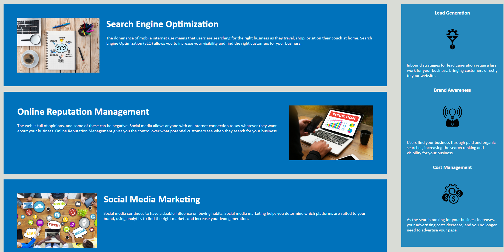

# First-Challenge

## Description

This is my first challenge project. The goal is to optimize already existing code and make sure the search engine optimization is the best it can be. Also, commenting the code and cleaning it up to look very pleasing.

## Installation

Follow the link in Github and it will take you straight to the project.

## Usage

Scroll down the page or use the navigation bar to take you right to where you want to be. The website provides help with search engine optimization, online reputation management, and social media marketing.

## Credits

Zach Barnes personal github - https://github.com/TooSparky

## License

No licenses